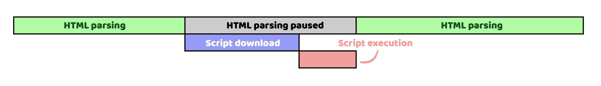
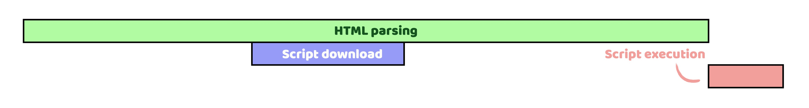
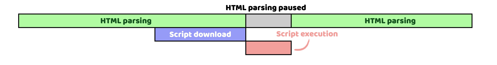

# Nov. 2022

## 1 st
### 打包工具
* Turbopack
  > Turbopack 是針對 JavaScript 和 TypeScript 優化的增量打包工具。<br>
  > 由 Webpack 的創建者和 Next.js 團隊使用 Rust 編寫。
### JavaScript 與 TypeScript 執行環境
* Node.js
  > 基於 V8 引擎，並且是由 C++ 語言所建構
* Deno
  > 基於 V8 引擎，並且是由 Rust 語言所建構<br>
  > 內建支援 TypeScript 執行<br>
  > 不再需要如 npm 的套件管理工具，同時扮演了套件管理系統的角色<br>
  > 如果要指定特定版本的套件也可以在 URL 中指定<br>

  [⋯ Reference](https://ianchen0119.gitbook.io/deno/an-zhuang-bing-shi-yong-deno/deno-gen-node.js-de-zhu-yao-cha-yi)
  
## 3 rd
### 工具
* Yup
  > 第三方驗證函式庫。<br>
  > 用於解析和驗證 JS 的生成器，使用 object 的驗證套件。<br>
  > schema 可以說是對於「資料格式」與「數值」的一種描述架構，透過事先定義 schema 就像先訂好規則，然後要求 form 表單的資料要能夠匹配 schema，而 Yup 就是幫助我們整合這兩者的工具之一。<br>
  > * 優點
  > 1. 每個檢核子介面都設計淺顯易懂，且可以串接、好閱讀
  > 1. 基本檢核一應俱全且統一
  > * 缺點
  > 1.  yup 內的程式碼出錯時，不會有任何反應<br>
  >
  > 建議都需要用 `try-catch` 包起來比較保險。

## 4 th
### CSS
* `::selection`
  > 此偽元素將樣式應用於文件中已被使用者選取強調的部分（例如在文件上單擊並拖動鼠標）。
### CSS 框架
* [Tailwind Tips](https://www.protailwind.com/tips)
  > 集合了有關 Tailwind 的有用小訣竅等。
### 工具
* [Dropcode](https://github.com/egoist/dropcode)
  > 簡單輕量的片段程式碼管理器

## 5 th
### Javascript
  
* 淺拷貝 Shallow Copy
  > 原始物件資料與複製物件資料「並非完全獨立」，可能第一層就有指向相同地址的資料，也可能第二層才有指向相同地址的資料。彼此資料內容的改變可能會互相影響。
* 深拷貝 Deep Copy
  > 原始物件資料與複製物件資料「完全獨立」，沒有任何一層資料指向相同的地址。彼此資料內容的改變不會互相影響。<br>
  > 1. `JSON.parse(JSON.stringify(obj))`<br><span class="span-mb"></span>
  > 某些值經過 `JSON.stringify/parse` 處理後，會產生變化：
  > * `undefined`：會連同 key 一起消失
  > * `NaN`：會被轉成 `null`
  > * `Infinity`：會被轉成 `null`
  > * `regExp`：會被轉成空 `{}`
  > * `Date`：型別會由 Data 轉成 string<br>
  > 2. `_.cloneDeep(obj)`<br><span class="span-mb"></span>
  > ladash 內部的 API
  > 3. Recursive deepCopyFunction<span class="span-mb"></span>
  > 寫一份遞迴函式，遍歷 Object data 每一層級資料，將其完全複製新的一份。

  
  圖片來源：https://www.programfarmer.com/articles/javaScript/javascript-shallow-copy-deep-copy

## 6 th
### 技術
* CSR (Client-Side Rendering)
  > 表示所有的頁面渲染 (render) 都透過瀏覽器端的 JS 來完成。<br>
  > 所有的邏輯、取資料、路由、template 都在客戶端處理。
  > * 優點
  > 1. 頁面的更新或是換頁都不需要刷新頁面，在使用體驗上相較於傳統的 SSR 應用會順暢許多。
  > * 缺點
  > 1. 載入速度通常較慢，尤其是在低階的行動裝置上。<br><span class="span-mb"></span>
  > 原因如前所述，因為 CSR 要等待 JS 的下載及執行 render ，所以 CSR 頁面載入的前幾秒，頁面上會沒有東西或是只有一些骨架。<br>
  > 使用者必須要等待一段時間才能看到頁面的內容，相對來說會是較差的使用者體驗。
  > 1. SEO 較差，因為 CSR 的頁面對於爬蟲是比較不友善的。<br><span class="span-mb"></span>
  > 雖然爬蟲有辦法執行 JS，但爬蟲也有一些 JavaScript render 頁面的限制。
  
* SSR (Server-Side Rendering)
  > 表示伺服器收到使用者的請求之後，在伺服器端生成完整的 HTML，再回傳給使用者。<br>
  > 因為生成 HTML 的時候會在伺服器端先取得內部或外部 API 資料，所以相較於 CSR 從瀏覽器端取資料的模式，SSR 可以省去多次的來回往返。
  > * 優點
  > 1. 需要的 JS 比較少，因此有較快的 TTI，可以較快開始互動。<br><span class="span-mb"></span>
  > 原因是相較於 CSR 所有 render 的邏輯都包含在 JS 中，SSR 已經在伺服器端把 render 的工作做完了，SSR 方案中瀏覽器端需要的 JS 理論上會比較少，所以會比較快達到 TTI。<br>
  > 1. 有更多的 JS 預算可以留給其他第三方 JS 使用。
  > 1. SEO 較佳。<br><span class="span-mb"></span>
  > 因為 SSR 產生的完整 HTML 可以很容易的被爬蟲解讀，不需要想辦法執行 JS。
  > * 缺點
  > 1. 較慢的 TTFB。<br><span class="span-mb"></span>
  > 因為在伺服器產生完整的 HTML 很花時間。如果同時有許多人造訪 server 造成負擔很重，或是有一些非常慢的 API，都有可能讓 server 的回應速度非常慢。
  > 1. 互動性體驗差。<br><span class="span-mb"></span>
  > 因為 SSR 的頁面在每次互動之間都要重新讀取頁面，這在使用體驗上就不如 CSR 的頁面順暢，也是現代 web app 大多數會採用 CSR 方案的主要原因。
  
  [⋯ Reference](https://shubo.io/rendering-patterns/)

  ::: tip
  * FCP (First Contentful Paint，使用者可以看到頁面上的重要內容的時間點) 
  * TTI (Time-to-Interactive，使用者首次可以跟頁面互動的時間點)<br>
  在 TTI 之前，使用者點畫面上任何東西都不會有反應。
  * TTFB (Time to First Byte，從瀏覽頁面的動作開始到瀏覽器收到第一個 byte 所需要的時間)
  :::


## 7 th
### CSS
* 偽元素
  > 它不是真正網頁裡的元素，但行為與表現和真正網頁元素一樣，也可以對其使用 CSS 操控。<br>
  > 在 W3C 的定義裡總共有五個偽元素：<br>
  > `::before`、`::after`、`::first-line`、`::first-letter` 和 `::selection`。
* `::before` 與 `::after`
  > 最常使用的偽元素，兩者都是以 `display: inline-block;` 的屬性存在。<br>
  > `::before` 是在原本的元素<span class="y-mark">之前</span>加入內容，`::after` 則是在原本的元素<span class="y-mark">之後</span>加入內容。<br>
  > 同時偽元素也會<span class="y-mark">繼承</span>原本元素的屬性。<br>
  
  > 一定要具備 content 的屬性，就算是只有 `content: "";` 都可以，因為沒有 content 的偽元素是不會出現在畫面上的，然而 content 是個很特別的屬性，它可以使用 attr 直接獲取內容元素的屬性值 (attribute）。<br>
  > content 內容是可以<span class="y-mark">相加</span>的，不過用法不像 JS 使用 + 號來相連，而是直接用一個空白鍵就可以不斷的累加下去。<br>
  
  > 偽元素的內容實際上不存在網頁裡 (如果打開瀏覽器的開發者工具，是看不到內容的)，所以如果在裡頭塞了太多的重要的內容，反而會影響到 SEO 的成效，因此對於使用偽元素的定位，還是當作<span class="y-mark">輔助</span>性質會比較恰當。

## 10 th
### CSS
* `initial`：恢復為該 css 屬性的初始值。
  > 每個 css 屬性都有其初始值（initial value），例如背景色的初始值就是透明。
* `inherit`：繼承最近的父層 css 屬性值。
  > 每個 css 屬性也都有繼承性（inherited）。<br>
  > 例如 `color` 有繼承性，而 `background-color` 則無。
* `unset`：是 `inherit` 和 `initial` 的結合。
  > 在屬性有繼承性時，設定 `unset` 會等同於 `inherit` 的功能。<br>
  > 無繼承性時，設定 `unset` 則等同於 `initial`。
* `revert`：優先恢復為瀏覽器預設。
  > 無瀏覽器預設則等同 `unset`。


### HTML
* `<iframe>`：內嵌框架 (Inline Frame)
  > 所謂的內嵌框架（內聯框架），用來在一個 HTML 網頁裡面嵌入另外一個 HTML 網頁。<br>
  > 但一般如果不是用來嵌入外站的內容，還是盡量少用 `iframe`，因為 `iframe` 還是對網頁效能、維護性和 SEO 有非正面的影響。
  > * `src`：指定要被嵌入的網頁的網址 (URL)
  > * `height`：指定 iframe 的高度，單位為像素 (pixel)
  > * `width`：指定 iframe 的寬度，單位為像素 (pixel)
  > * `name`：指定 iframe 的名稱
  > * `sandbox`：當有這屬性時，表示針對 iframe 裡面的網頁啟用一些限制條件。<br>
  > 屬性值如果留空表示啟用所有限制，當有設定值的時候表示移除這些限制，你可以用空格設定移除多個限制條件。<br>
  >
  > [⋯ Reference](https://www.fooish.com/html/iframe-tag.html)

## 12 nd
* `clamp(MIN, VAL, MAX)`
  > 包含三個數值，定義「最大值、最小值以及中間的數值」。<br>
  > 其中 `MIN` 表示最小值，`VAL` 表示首選值，`MAX` 表示最大值。
  > 1. 如果 `VAL` 在 `MIN` 和 `MAX` 範圍之間，則使用 `VAL` 作為函數回傳值。
  > 1. 如果 `VAL > MAX`，則使用 `MAX` 作為回傳值。
  > 1. 如果 `VAL < MIN`，則使用 `MIN` 作為回傳值。<br>
  >
  > 範例：
  > ```javascript
  > clamp(200px, 100%, 300px);
  > ```

## 15 th
### 配置
* [Package.json](../notes/front-end/package-json.md)
  > 個人筆記連結
## 19 th
### Javascript
* [prototype 原型與原型鏈](../notes/front-end/js-prototype.md)
  > 個人筆記連結

## 21 st
### ES module 
ES6 版本新加了 `import` 和 `export`，引入了「模組化」的思維，讓 JavaScript 在開發大型複雜應用程式時，更為方便且易於管理。<br>
只要在 `<script>` 加上 `type="module"` 的 attribute，就可以在 `script` 裡面使用 `import` 與 `export` 。
* Default exports & Named exports
```javascript
// Default exports
export default 7

// Named exports
export const monthDays = 31
export const log = () => { console.log('Hello, world!') }
```

* import 靜態載入 
```javascript{1}
import weekDays, { monthDays, log } from './script.js'

console.log(weekDays) // 7
console.log(monthDays) // 31
log() // Hello, world!
```

* import 動態載入
```javascript{2}
btn.addEventListener('click', () => {
  import('./modules/test.js').then(result => {
    console.log(result);
  })
});
```
> 有些 script 只有特定情況才需要時可以使用動態載入，透過管理回傳的 `Promise` 物件，盡可能提升 performance，避免一次性載入太多用不到的 js，造成首次白畫面過長。

* 優點
1. 每個 `.js` 都是獨立的作用域（scope），不用擔心變數汙染。
2. 每個 `.js` 都自行 `import` 自己的依賴，沒有順序相依問題。

[⋯ Reference](https://ithelp.ithome.com.tw/m/articles/10303710)
## 24 th
### CSS
* Positioning schemes（定位規則）
  * normal flow<br>
    > HTML 元素就是 `inline` 跟 `block` 兩類，所以 `normal flow` 就是由水平排列，以及垂直向下排列這樣的格式來渲染元素。<br>
    > 除非特別聲明，否則每個元素所產生的 `box` 都處在 `normal flow` 中。
  * float<br>
    > `box` 從原本的 normal flow 中脫離出來，並以 `left`、`right` 參數來定位，通常用在文繞圖的排版中。
  * absolute positioning<br>
    > 和 float 同為 `out of flow`（脫離普通流）的定位，並以 `top`、`left`、`bottom`、`right` 搭配數值予以定位。

* Formatting context（格式化上下文）
  > 是 CSS 中對於排版的概念，不同的格式化環境會有不同的渲染規則，決定box怎麼被排列、怎麼影響跟其它box的相對位置，也決定了其子元素的排列。<br><span class="span-mb"></span>
  > <b>formatting context 有以下類型：</b>
  > 1. BFC (Block formatting context)
  > 2. IFC (Inline formatting context)
  > 3. FFC (Flex formatting context)
  > 4. GFC (Grid formatting context)
  >
  > 以上都屬於 normal flow 的 範圍。<br><span class="span-mb"></span>
  > 除了原本元素產生的原生 `box` 有 block-level box 跟 inline-level box 之外，也可以用 CSS 的 `display` 屬性來改變 `box` 所參與的 formatting context。<br>
  > 有些屬性可以對 `box` 內創造一個 formatting context 的環境，例如生成 BFC、FFC、GFC 渲染環境給後代元素，而 IFC 是指元素參與 IFC 的佈局。

* BFC（Block formatting context）
  > 是一個獨立的渲染區域，只有 Block-level box 參與，規定了內部的 block-level box 如何佈局，並且與這個區域外部毫無關聯。
  > * 佈局規則
  > 1. 內部的 box 會在垂直方向，一個接一個地放置。 
  > 2. box 垂直方向的距離由 margin 決定。屬於同一個 BFC 的兩個相鄰 Box 的 margin 會發生重疊。
  > 3. 每個元素的 margin box 的左邊， 與包含 block border box 的左邊相接觸（對於從左往右的格式化，否則相反），即使存在浮動也是如此。
  > 4. BFC 的區域不會與 float box 重疊。
  > 5. BFC 就是頁面上的一個隔離的獨立容器，容器裡面的子元素不會影響到外面的元素；反之也如此。 
  > 6. 計算 BFC 的高度時，浮動元素也參與計算。
  > * 主要作用
  > 1. 自適應兩欄佈局 
  > 2. 可以阻止元素被浮動元素覆蓋
  > 3. 可以包含浮動元素（清除內部浮動）
  > 4. 分屬於不同的 BFC 時可以阻止 margin 重疊

## 26 th
### 工具
* [axios](../notes/front-end/axios.md)
  > 個人筆記連結

* [json server](https://github.com/typicode/json-server)
  > 可以透過 JSON 格式，快速產生 DEMO 用的 API。

## 28 th
### Vite deploy
* GitHub Pages
1. 在 `vite.config.js` 內部設定 `base` 名稱（通常為 `'/<REPO>/'`）
```ts{2}
export default defineConfig({
  base: '/<REPO>/',
  plugins: [...]
})
```
2. 在專案目錄內新建檔案 `deploy.sh` 並貼上以下內容
```sh
#!/usr/bin/env sh

# delete dist folder
rm -rf dist

# abort on errors
set -e

# build
pnpm run build

# navigate into the build output directory
cd dist

# place .nojekyll to bypass Jekyll processing
echo > .nojekyll

git init
git checkout -B main
git add -A
git commit -m 'deploy'

git push -f https://github.com/<USERNAME>/<REPO>.git master:gh-pages

cd -
```
3. 執行 `deploy.sh` 檔案
```
sh deploy.sh
``` 
> 將會建出新的 `dist` 目錄並將專案內容 build 完放進 `dist` 中。<br>
> 再將 `dist` 目錄內容 `push` 到 GitHub 專案上的 `gh-pages` 分支上。

[⋯ Reference](https://vitejs.dev/guide/static-deploy.html#github-pages)
### JS
* `new URL(url [, base])`
  > 1. `url`<br>
  > 是一個表示絕對或相對 URL 的 `DOMString`。<br>
  > 如果 `url` 是相對 URL，則會將 `base` 用作基準 URL。<br>
  > 如果 `url` 是絕對 URL，則無論參數 `base` 是否存在，都將被忽略。
  > 2. `base`<br>
  > 是一個表示基準 URL 的 `DOMString`，在 `url` 是相對 URL 時才會有效果。<br>
  > 如果未指定，則默認為 `''`。
```js
const url = new URL('https://exp.com/js/2#tag=es6')
```
| 屬性 | 內容名稱 | 範例 |
| --- | --- | --- |
| `url.href` | 完整網址（URL）| `"https://exp.com/js/2#tag=es6"` |
| `url.hash` | 網址中的 Hash 部分 | `"#tag=es6"` |
| `url.host` | 網址中的主機名稱 | `"exp.com"` |
| `url.pathname` | 網頁路徑部分 | `"/js/2"` |
| `url.protocol` | 網址中的通訊協定部分 | `"https:"` |

* 取得網頁參數部分
```js
const url = new URL('https://exp.com?tag=es6&page=2&tag=url')
const params = url.search // "tag=es6&page=2&tag=url"
const params = url.searchParams // URLSearchParams {}

params.has('page') // true
params.get('tag')  // es6
```

## 30 th
### JS
* `async`, `defer` attributes
1. `<script>`

```html
<p>...content before script...</p>
<script src="demo.js"></script>

<!-- 當 JS 還沒下載與解析完前，HTML 的繪製會卡在這，因此需等到 script 載入完後，才會看到下面的內容 -->
<p>...content after script...</p>
```
2. `<script defer>`

```html
<script src="demo1.js" defer></script>
<script src="demo2.js" defer></script>
```
> 網頁繪製不會停下， `demo.js` 在背景下載，不會阻塞頁面的繪製，並且會等到 DOM 準備好後（但 `DOMContentLoaded` 事件發生前）才加以執行。<br>
> 因此相當實用，且目前瀏覽器多已經支援。<br>
> 和傳統只使用 `<script>` 的方式一樣，使用 `defer` 能夠保證 `scripts` 的檔案會按照 document 中的順序執行。<br>
> 以上面的程式碼為例，`demo1.js` 和 `demo2.js` 會同時才背景開始被下載，但即使 `demo2.js` 比較早下載完成，瀏覽器仍會確保 `demo1.js` 執行完後才執行 `demo2.js`。

:::tip
`defer` 適合用在需要等待 `DOM` 完成後才能被執行的 JS，後者多個 JS 檔彼此之間有相依性的情況。
:::

3. `<script async>`

```html
<script src="demo1.js" async></script>
<script src="demo2.js" async></script>
```
> 和 `defer` 類似的是 `demo1.js` 和 `demo2.js` 都會在背景下載，但不同的地方在於，`async` 會在該 JS 檔下載完成後，就會馬上被執行。<br>
> 它不會等待 `DOM` ready 後才執行，也不保證各 `script` 間執行的順序，也就是說，如果 `demo2.js` 比 `demo1.js` 還快被下載完成的話，它就會先被執行。<br>
> 因此，`async` 適合用在每個 `script` 的 JS 檔彼此之間沒有相依性，不需要誰先執行才能換另一個執行的這種情況（例如，Google Analytics）。
:::tip
`async` 適合用在各 `script` 間的 JS 檔沒有相依的情況下使用，例如 Ads、GA 等等。
:::
[⋯ Reference](https://pjchender.dev/javascript/js-async-defer/)

### 瀏覽器私有屬性
* `-moz-`：代表 firefox 瀏覽器私有屬性
* `-ms-`：代表 IE 瀏覽器私有屬性
* `-webkit-`：代表 chrome、safari 私有屬性
* `-o-`：代表 opera 私有屬性

### 資源
* [Can I Use](https://caniuse.com/)
  > 可以用來查詢 HTML、CSS 的瀏覽器兼容度。


<style>
  .y-mark {
    background-color: #fff6ba;
    padding: 0.15rem;
  }

</style>